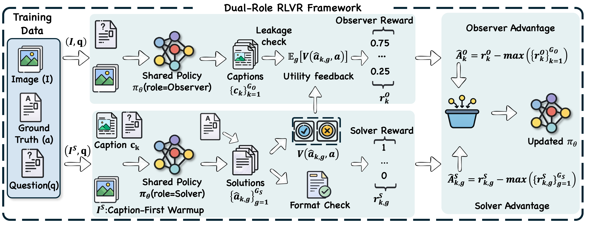

<div align="center">


# 🔭 Seeing with You: Perception-Reasoning Co-evolution for Multimodal Reasoning

**Official implementation of _Seeing with You: Perception-Reasoning Co-evolution for Multimodal Reasoning_**


[](https://arxiv.org/) [](https://huggingface.co/collections/miaozq/prco) [](https://github.com/Dtc7w3PQ/PRCO)

</div>


<p align="center">If you find our project helpful, please consider giving us a star ⭐ on GitHub!</p>

## Overview

PRCO is a dual-role reinforcement learning with verifiable rewards (RLVR) framework for multimodal reasoning.

- **Observer**: extracts question-relevant visual facts from the image and produces a question-conditioned evidence caption.
- **Solver**: predicts the final answer from the caption, optionally consulting the image when needed.
  

<p align="center">
  
</p>
<p align="center">
  <em>Figure: Overview of PRCO.</em>
</p>

---

## 🚀 News

- **[2026/03/25]** We've released the paper, model checkpoints, and evaluation code for PRCO.
---
## TODO List

- [x] Release PRCO checkpoints (3B / 7B / 8B)
- [x] Release evaluation code
- [ ] Release training code

---

## Highlights

- **Dual-role RLVR framework** for multimodal reasoning with a shared policy.
- **Observer/Solver decomposition** for explicit separation of perception and reasoning.
- **Reliable role-specific rewards** for better gradient-level credit assignment.
- **Consistent gains across model scales**, including strong improvements on both 3B and 7B backbones.
- **Broad benchmark coverage** across visual math, geometry, logic, and multidisciplinary reasoning.

---

## Benchmark Results

### Main Results on 8 Benchmarks (7B)

| Model | MathVerse | MathVision | MathVista | WeMath | DynaMath | LogicVista | MMMU-Pro | MMStar | Avg. |
| --- | ---: | ---: | ---: | ---: | ---: | ---: | ---: | ---: | ---: |
| Qwen2.5-VL-7B | 43.02 | 25.46 | 70.20 | 35.43 | 20.35 | 45.41 | 35.49 | 64.26 | 42.45 |
| DAPO | 48.73 | 29.30 | 74.80 | 45.62 | 26.14 | 47.87 | 41.38 | 65.40 | 47.41 |
| PRCO-7B | **49.49** | **30.86** | **77.10** | **50.29** | **29.74** | **49.66** | **42.08** | **67.80** | **49.63** |
<!-- 
### Main Results on 8 Benchmarks (3B)

| Model | MathVerse | MathVision | MathVista | WeMath | DynaMath | LogicVista | MMMU-Pro | MMStar | Avg. |
| --- | ---: | ---: | ---: | ---: | ---: | ---: | ---: | ---: | ---: |
| Qwen2.5-VL-3B | 34.13 | 22.50 | 65.00 | 23.52 | 12.37 | 38.70 | 26.76 | 56.06 | 34.88 |
| DAPO | 40.98 | 27.40 | 70.20 | 35.14 | 20.35 | 43.62 | 31.73 | 60.40 | 41.23 |
| PRCO-3B | **42.51** | 27.27 | **70.30** | **40.00** | **22.36** | **44.97** | **31.85** | **61.00** | **42.53** | -->

<!-- <p align="center">
  
</p>
<p align="center">
  <em>Figure: Main benchmark results and analysis. Replace this placeholder with your final figure.</em>
</p> -->

---

## Model Zoo

| Model | Backbone | Status | Link |
| --- | --- | --- | --- |
| PRCO-3B | Qwen2.5-VL-3B | Released | [Checkpoint](https://huggingface.co/miaozq/PRCO-3B) |
| PRCO-7B | Qwen2.5-VL-7B | Released | [Checkpoint](https://huggingface.co/miaozq/PRCO-7B) |
| PRCO-8B | Qwen3-VL-8B | Released | [Checkpoint](https://huggingface.co/miaozq/PRCO-8B) |
---

## Usage

### 1. Installation

```bash
git clone https://github.com/Dtc7w3PQ/PRCO.git
cd PRCO
conda create -n prco python=3.12 -y
conda activate prco
pip install -r requirements.txt
```

### 2. Evaluation

PRCO-3B / PRCO-7B / PRCO-8B use the same evaluation workflow.

1. Fill environment variables in `VLMEvalKit/.env`:

```bash
LMUData="<PATH_TO_LMUDATA>"
OPENAI_API_KEY="<YOUR_OPENAI_API_KEY>"
OPENAI_API_BASE="<YOUR_OPENAI_API_BASE>"  # optional
```

Then load them in your shell:

```bash
set -a
source VLMEvalKit/.env
set +a
```

2. Set the correct local checkpoint path in each model config (both `observer.model_path` and `solver.model_path`):

- `VLMEvalKit/scripts/prco_3b/config.json`
- `VLMEvalKit/scripts/prco_7b/config.json`
- `VLMEvalKit/scripts/prco_8b/config.json`

3. Run inference and evaluation scripts.

Example for one model (`prco_7b`):

```bash
cd VLMEvalKit
bash scripts/prco_7b/infer.sh
bash scripts/prco_7b/eval.sh
```

Run all three models with the same pipeline:

```bash
cd VLMEvalKit
for m in prco_3b prco_7b prco_8b; do
  bash scripts/$m/infer.sh
  bash scripts/$m/eval.sh
done
```

Logs are written to:

- `VLMEvalKit/scripts/<model_name>/infer.log`
- `VLMEvalKit/scripts/<model_name>/eval.log`

Predictions and evaluation outputs are written under:

- `VLMEvalKit/outputs/<model_name>/`

### 3. Training

Train PRCO with the dual-role Observer/Solver framework:

```bash
Coming soon...
```
---

## Citation

If you find this project helpful, please cite our paper:

```bibtex
@article{Coming soon,
  title={Seeing with You: Perception-Reasoning Co-evolution for Multimodal Reasoning},
  author={AUTHOR_LIST},
  journal={arXiv preprint arXiv:XXXX.XXXXX},
  year={2026}
}
```

---

## Acknowledgement

This project is built around open multimodal reasoning research.  We especially thank the open-source communities behind [vLLM](https://github.com/vllm-project/vllm), [EasyR1](https://github.com/hiyouga/EasyR1), and [verl](https://github.com/volcengine/verl), which made this work possible.
